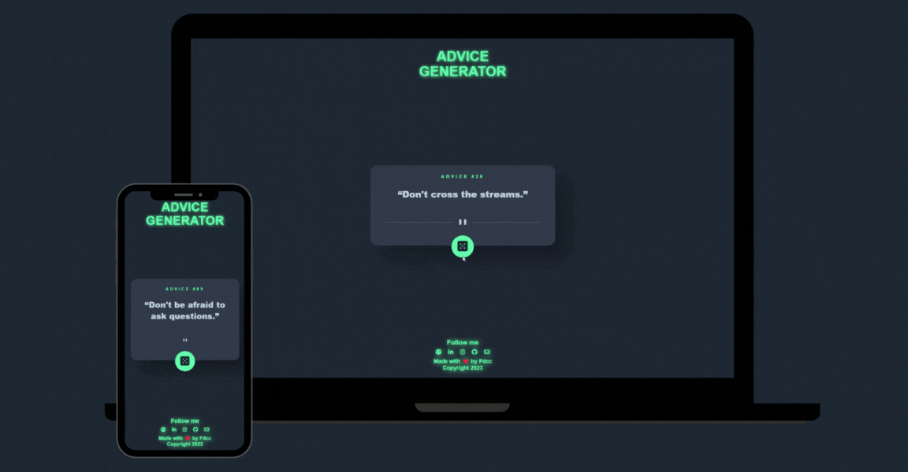

# Fdcc Advice Generator App

 

### Request 💼
Build out an advice generator app using the [Advice Slip API](https://api.adviceslip.com/) and get it looking as close to the original design as possible.  
More information [Advice Generator App Challenge](https://www.frontendmentor.io/challenges/advice-generator-app-QdUG-13db) on Frontend Mentor.

### Features ⚡
- [x] View the optimal layout for the app depending on their device's screen size.
- [x] See hover states for all interactive elements on the page.
- [x] Generate a new piece of advice by clicking the dice icon.

### My app is developed with 🧑‍💻
- [Visual Studio Code](https://code.visualstudio.com/) as code editor.
- [HTML5](https://developer.mozilla.org/en-US/docs/Web/Html) as markup language.
- [Sass/SCSS](https://sass-lang.com/) as CSS extension language.
- [Javascript](https://developer.mozilla.org/en-US/docs/Web/JavaScript) as scripting language.
- [React.js](https://reactjs.org/) as JavaScript library.
- [Next.js](https://nextjs.org/) as React framework.

### Author 🧑‍🦰
- [Francesco De Caro Carella](https://francescodecarocarella.it/), Front-End Developer and Graphic Designer. You can find me on [Linkedin](https://it.linkedin.com/in/francescodecarocarella), [Instagram](https://www.instagram.com/fdcc_webdev/) and [Github](https://github.com/FrancescoDeCaroCarella).